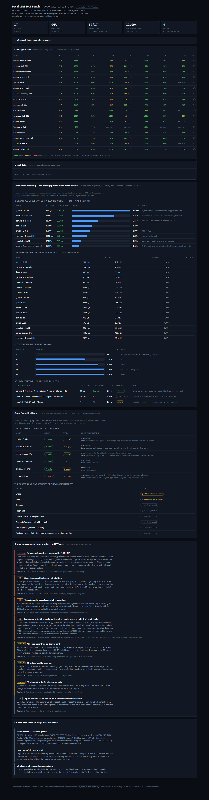

# Local LLM Test Bench — coverage dashboard

A single-file, dependency-free page that shows how a roster of **locally-servable LLMs**
scored across eight evaluation batteries, what the numbers *don't* cover, and the
speculative-decoding throughput that the battery suite itself under-reports.

Open `index.html` in a browser. No build step, no server, no network calls — the data is
embedded in the file, so it works from `file://` and from GitHub Pages unchanged.



## What's on the page

| Panel | What it answers |
|---|---|
| **Coverage matrix** | Every model × every battery. Click a column header to sort; click a row to expand that model's sub-scores. Blank cells mean *not run* — never a zero score. |
| **Model detail** | Per-model drill-down: B1 by business unit, B6 by coding track, B8 by task category, plus its one-shot game verdicts and edit-workload throughput. |
| **Speculative decoding** | The 2–12× n-gram speedups on edit/rewrite work, why the suite's own B5 arm shows ~1.00×, `n-match` tuning, and MTP draft-head results. |
| **Game builds** | The Snake/Tetris one-shot results that exist, and the roster (Arkanoid, Flappy Bird, Asteroids, 3D flight sim, …) that was specified but never built. |
| **Known gaps** | Severity-ranked list of what these numbers do **not** measure. Read this before ranking anything. |
| **Caveats** | Hardware non-interchangeability, how the incremental B1 judging was calibrated, what spec-decode speedup depends on. |

## The batteries

| ID | Battery | Unit | Kind |
|---|---|---|---|
| B1 | Business Scorecard — 15 units × 8 tasks × 3 reps, blinded 3-judge panel | /10 | judged |
| B2 | Tool Calling — schema/selection/shape of emitted tool calls | % | deterministic |
| B3 | Hallucination Resistance — unanswerable / false-premise prompts | % | deterministic |
| B4 | Long-Context Retrieval — needle recall over a 16k→256k sweep | % | deterministic |
| B5 | Serving Throughput — decode t/s with a spec-decode on/off arm | t/s | deterministic |
| B6 | Agentic Coding — 5 from-scratch + 5 planted-bug tasks | % | deterministic |
| B7 | Reproducibility — signal agreement across a config matrix | % | deterministic |
| B8 | Agentic Harness — real OpenCode agent in a container, 23 sealed tasks | % | deterministic |

## Three things that are easy to misread

1. **B8 is not a delegation ranking.** Every B8 row for every model records
   `subagent_spawned = no` — none of the tasks *requires* spawning a subagent. A model can
   top B8 on single-agent coding while failing at delegation entirely. That behaviour is
   measured by nothing here.
2. **B5 under-reports speculative decoding by design of its workload.** Its spec arm
   generates fresh text, where n-gram drafting almost never hits (~1.00×). On edit/rewrite
   work — what agentic coding actually does — the same flag is worth **1.95× to 12.08×**.
3. **Hardware is not interchangeable.** Re-running one model on an A100 instead of a
   Blackwell moved its deterministic scores by up to 13 points *at temperature 0*, because
   batching and GPU numerics shift borderline outputs.

## Regenerating the data

`build_data.py` recomputes everything that has a machine-readable source directly from the
eval shards, then re-embeds the result into `index.html`:

```bash
python build_data.py           # rewrite data.json + re-embed into index.html
python build_data.py --check   # report what would change, write nothing
```

It expects the eval repo as a sibling directory:

```
.
├── llm-eval-dashboard/     <- this project
└── llmtest-v2/
    ├── results/rows-suite-v2.*.jsonl
    └── results_b8_<model>/
```

Recomputed from shards: B2/B3/B6 deterministic pass rates, B4 needle recall, B5 decode t/s
(and its spec on/off arms), B7 agreement, B8 completion + per-category breakdown.
Carried as labelled constants with their source recorded: the B1 panel scores, the
edit-workload n-gram/MTP tables (`RESULTS5-local-lowbit-codegen.md`), and the ad-hoc game
verdicts (`benchmark-tables.md`). Ad-hoc laptop results are never silently mixed with
suite results — they render in their own panel with a "not a scored battery" banner.

## Verifying a change

The page is checked by rendering it, not by eyeballing the source:

```bash
python - <<'EOF'
from playwright.sync_api import sync_playwright
from pathlib import Path
url = "file:///" + str(Path("index.html").resolve()).replace("\\", "/")
with sync_playwright() as p:
    b = p.chromium.launch(executable_path=r"C:\Program Files\Google\Chrome\Application\chrome.exe")
    pg = b.new_page(viewport={"width": 1400, "height": 1100})
    errs = []
    pg.on("pageerror", lambda e: errs.append(str(e)))
    pg.goto(url); pg.wait_for_timeout(1000)
    print("matrix rows:", pg.locator("table.matrix tbody tr").count())
    pg.screenshot(path="preview.png", full_page=True)
    print("page errors:", errs or "none")
    b.close()
EOF
```

## Design notes

Dark instrument-panel styling, one accent hue. Colour encodes **magnitude only** (each
battery normalised within its own range); identity is carried by row labels, never by hue,
so no categorical palette is in play. Status is always an **icon plus a word**
(`✓ works` / `△ bugs` / `✗ broken` / `○ specified, not built`) so it survives colourblind
and greyscale reading. Speedup bars are single-hue, baseline-anchored, directly labelled.

## Licence / provenance

Results were produced by the `llmtest-v2` harness on an RTX 5090 Laptop (24 GB) and rented
RTX PRO 6000 Blackwell instances. Model names are upstream Hugging Face repo identifiers.
